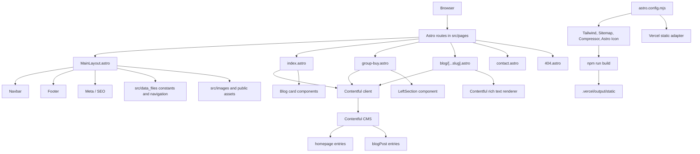

# 豬豬隊友scott & wendy

Astro static website for 豬豬隊友scott & wendy. The site uses Contentful for homepage and blog/group-buy content, Astro for static page generation, Tailwind CSS for styling, and Vercel static output for deployment.

## What This Site Contains

- Home page: pulls the homepage hero and latest posts from Contentful.
- Group-buy page: lists Contentful `blogPost` entries as offers/articles.
- Blog detail pages: generated from Contentful blog slugs.
- Contact page: lightweight static contact/brand page.
- Shared layout: navbar, footer, SEO metadata, favicons, manifest, and smooth scrolling.

## First-Time Setup

Prerequisites:

- Node version from `.nvmrc`
- Vercel CLI: `npm i -g vercel`
- Access to the project Vercel team/project
- Access to the Contentful space

```bash
git clone <repo-url>
cd piglet
nvm use
npm install
vercel link
vercel env pull
npm run dev
```

The local dev server usually runs at `http://127.0.0.1:4321/`. If port `4321` is busy, Astro will choose the next available port and print the URL in the terminal.

## How To Update Content

Most client-facing content is managed in Contentful.

### Homepage

Update the Contentful `homepage` entry:

- `title` controls the hero heading.
- `description` controls the hero supporting text.
- `heroBanner` controls the hero background image.
- `actionLinkText` and `actionLinkUrl` control the hero button.

The Astro page that renders this content is `src/pages/index.astro`.

### Blog And Group-Buy Posts

Create or update Contentful `blogPost` entries:

- `title` appears on blog cards and detail pages.
- `description` appears in listing cards and previews.
- `slug` becomes the URL, for example `/blog/my-post/`.
- `cardImage` is used as the listing/detail hero image.
- `content` is rendered as the blog article body.

The same `blogPost` entries power both:

- `/group-buy/`
- `/blog/[slug]/`

After changing Contentful content, rebuild/redeploy the site so static pages are regenerated.

### Navigation And Site Metadata

Local site identity and navigation live in:

- `src/data_files/constants.ts` - site title, description, canonical URL, author, Open Graph text.
- `src/utils/navigation.ts` - main navigation links and social URLs.
- `src/utils/fr/navigation.ts` - French-locale fallback navigation.

### Images And Icons

App icons and social preview image live in `src/images`:

- `icon.png`
- `icon-maskable.png`
- `icon.svg`
- `social.png`

Replace these files when updating the browser icon or social sharing preview.

## Common Commands

```bash
npm run dev       # Start local development server
npm run build     # Type-check and build the static site
npm run preview   # Preview the built output locally
npm run gen-type  # Regenerate Contentful types
```

`npm run build` writes static output to `.vercel/output/static` because the project uses the Vercel static adapter.

## Environment

The Contentful integration expects these variables:

```bash
CONTENTFUL_SPACE_ID=
CONTENTFUL_DELIVERY_TOKEN=
CONTENTFUL_PREVIEW_TOKEN=
CONTENTFUL_ACCESS_TOKEN=
```

`CONTENTFUL_DELIVERY_TOKEN` is used for production builds. `CONTENTFUL_PREVIEW_TOKEN` is used in local development. `CONTENTFUL_ACCESS_TOKEN` is only used by the type-generation script.

Keep these values in `.env` locally and in Vercel environment-variable settings for production. Do not commit real token values to the repository.

## Architecture



## Runtime Flow

- `src/pages/index.astro` fetches the homepage entry and recent `blogPost` entries from Contentful, then renders the hero and blog cards.
- `src/pages/group-buy.astro` fetches Contentful `blogPost` entries and renders them as a group-buy listing.
- `src/pages/blog/[...slug].astro` uses Contentful entries to generate static blog detail routes and renders rich-text content as HTML.
- `src/layouts/MainLayout.astro` wraps public pages with shared metadata, navbar, footer, Lenis smooth scrolling, and the main slot.
- `astro.config.mjs` controls static output, i18n routing, sitemap generation, compression, icons, and Vercel deployment.

## Route Map

- `/` - homepage
- `/group-buy/` - group-buy/blog listing
- `/blog/[slug]/` - generated blog detail pages
- `/contact/` - contact page
- `/404.html` - not-found page

## Main Paths

- `src/pages` - public Astro routes.
- `src/components` - shared layout, sections, cards, buttons, and UI blocks.
- `src/contentful` - Contentful client, generated content model types, and asset helpers.
- `src/data_files` - site constants and navigation copy.
- `src/images` - local images and app icons.
- `public/scripts/vendor` - browser-side vendor scripts used by the UI.

## Developer Notes

- The project is intentionally static. Contentful data is fetched at build time, not per request.
- The old template docs/services/product pages have been removed from the public build.
- When changing Contentful content models, run `npm run gen-type` and commit the generated files in `src/contentful/generated`.
- When changing routes or metadata, run `npm run build` before deploying.

## Contentful Types

Regenerate Contentful TypeScript types after changing the Contentful content model:

```bash
npm run gen-type
```

## Deployment Notes

The project is configured for Vercel static output via `@astrojs/vercel/static`. Production builds need access to Contentful delivery credentials.

Typical deployment flow:

1. Push changes to GitHub.
2. Vercel runs `npm run build`.
3. Astro fetches Contentful entries and writes static pages.
4. Vercel serves the generated static output.
